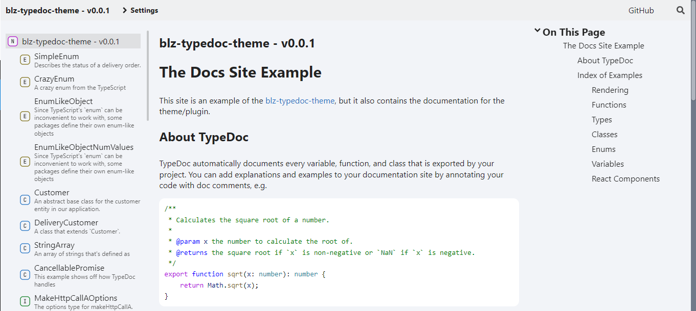

# blz-typedoc-theme



Typedoc theme made by Blazed Labs LLC (support v0.24).

[](https://blazedlabs.com/)

## Using This Theme
Either clone this repo and copy the /example directory, or:
1. Install typedoc & blz-typedoc-theme
```shell
npm install typedoc @blazed-space/blz-typedoc-theme
```
2. Create a typedoc config (typedoc.json)
```json
{
  "$schema": "https://typedoc.org/schema.json",
  "includeVersion": true,
  "plugin": ["@blazed-space/blz-typedoc-theme"],
  "theme": "my-theme",
  "entryPoints": ["./src/index.ts"],
  "out": "./docs"
}
```
3. Be sure to create a /media folder, and at minimum add a favicon.ico, manifest.json, and /styles/global.css.
4. To build documentation, add the following scripts to your **package.json**:
```json
{
    "scripts": {
        "docs:build": "npx typedoc",
        "docs:serve": "cd docs && npx static-server"
    }
}
```
5. You can now build docs using the command:
```shell
npm run docs:build
```
6. Once built, you can open the .html files directly in the browser (not reccommended) or you can run a local static server with the following command:
```shell
npm run docs:serve
```

## Local Development
1. To develop this theme locally, first clone the GitHub repo
```shell
git clone https://github.com/blazed-space/blz-typedoc-theme
```
2. Next, install dependencies with NPM:
```shell
npm install
```
3. Now you can build the library:
```shell
npm run lib:build
```
4. And build the example site:
```shell
npm run example:build
```
5. To serve the example site locally,
```shell
npm run example:serve
```